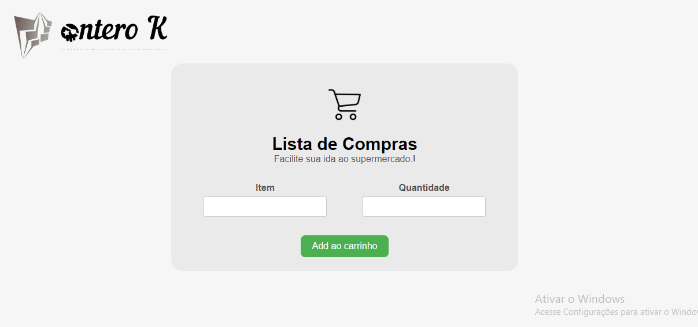

# Lista de Compras

### Requisitos

#### Formulário

+ Implemente a funcionalidade do formulário para que, ao submetê-lo, o item seja adicionado à lista de compras.
+ Você pode optar por utilizar inputs controlados ou não controlados. Pratique a abordagem com a qual você tem menos familiaridade.
+ Ao submeter um item, apague o formulário.
+ Ao submeter um item, dê o foco no primeiro input para que seja fácil escrever outro item novamente pelo usuário.

#### Concluir Item

+ Implemente a funcionalidade de marcar um item como concluído ao clicar no botão correspondente.
+ Este item deverá ser movido para a lista de "Itens já comprados".
+ O texto do item marcado deverá ser riscado e ter uma cor mais clara.
+ O ícone de "A fazer" (círculo vazio) deverá ser substituído pelo ícone de "Feito" (check).

#### Excluir Item

+ Implemente a funcionalidade de excluir um item ao clicar no ícone de lixeira.